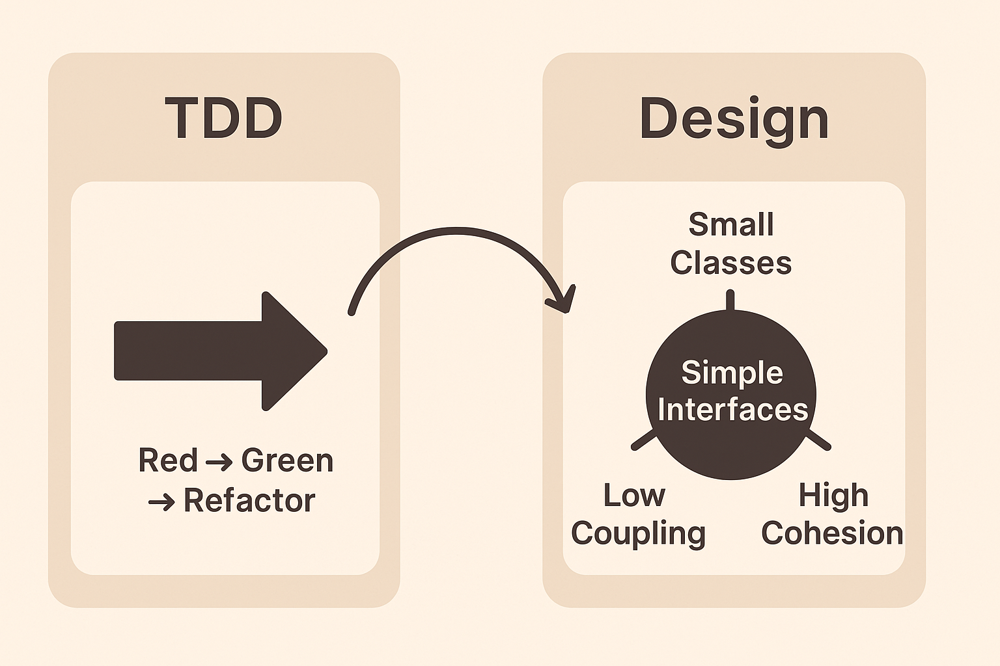

# Sessão 3 — Design Orientado a Testes (TDD + Design)

## 🎯 Objetivos

* Entender como o TDD influencia e guia decisões de design.
* Introduzir princípios de design simples aplicados com TDD.
* Mostrar como testes ajudam a criar código limpo, modular e fácil de manter.
* Exercitar a escrita de código testável desde o início.

---

## 📚 Material Teórico

### 1️⃣ O que é Design Orientado a Testes

* É a prática de **usar testes para guiar o design do software**, não apenas para validar.
* Ajuda a criar **interfaces pequenas e coesas**, **dependências claras** e **código mais flexível**.
* Reduz refatorações grandes e aumenta a confiança ao mudar código.

### 2️⃣ Como TDD influencia o Design

* **Red → Green → Refactor** não é só para testar, mas para evoluir o design gradualmente.
* Testes forçam você a pensar no **contrato das classes e métodos**.
* TDD incentiva:

  * **Alta coesão:** cada classe faz uma única coisa.
  * **Baixo acoplamento:** dependências explícitas e fáceis de substituir (ex.: injeção de dependência).
  * **Interfaces pequenas e claras:** fácil de testar e entender.

### 3️⃣ Princípios de Design com TDD

| Princípio                                 | Como TDD ajuda                                                                              |
| ----------------------------------------- | ------------------------------------------------------------------------------------------- |
| **SRP (Single Responsibility Principle)** | Testes pequenos naturalmente levam a classes com responsabilidades únicas.                  |
| **OCP (Open/Closed Principle)**           | Refactor guiado por testes incentiva extensões via abstrações sem quebrar código existente. |
| **DRY (Don't Repeat Yourself)**           | Testes repetidos revelam duplicações e incentivam refatoração.                              |
| **Interface Segregation**                 | Testes finos mostram se uma interface é muito grande ou se precisa de várias menores.       |

### 4️⃣ Boas práticas de Design Orientado a Testes

* Escreva testes **antes do código** e pense na **API pública** das classes.
* Prefira **classes pequenas** e **métodos curtos**.
* Use **mocks/fakes/stubs** para dependências externas.
* Refatore constantemente **após cada teste passar**.
* Evite designs rígidos: testes te mostram onde é difícil alterar código.



---

## 🛠️ Exercícios Práticos

1. Criar uma **classe de gerenciamento de contas bancárias** com TDD.

   * Comece escrevendo um teste que cria uma conta com saldo inicial.
   * Adicione testes para **depósitos, saques e saldo negativo**.
   * Refatore usando princípios de design (SRP, OCP).

2. Implementar **interfaces e injeção de dependência** para permitir fácil teste de serviços de notificação (email, SMS).

3. Bonus: Integrar o projeto a um pipeline **Azure DevOps** para rodar os testes automaticamente.

---

## 📝 Técnicas e Instrumentos de Avaliação

* **Pair Programming:** trabalhar em pares nos exercícios TDD.
* **Code Review:** revisar código dos colegas, focando em design guiado por testes.
* **Automação de Testes:** verificar se todos os testes passam no pipeline DevOps.

---

## **S – Single Responsibility Principle (SRP)**

Cada classe deve ter **uma única responsabilidade**.

```csharp
// Má prática: a mesma classe cuida de apólice e envio de e-mails
public class InsurancePolicy
{
    public string PolicyNumber { get; set; }
    public string CustomerEmail { get; set; }

    public void CalculatePremium() 
    {
        Console.WriteLine("Calculando prêmio da apólice...");
    }

    public void SendEmail() 
    {
        Console.WriteLine($"Enviando e-mail para {CustomerEmail}...");
    }
}

// Boa prática: separar responsabilidades
public class InsurancePolicy
{
    public string PolicyNumber { get; set; }
    public decimal Premium { get; set; }

    public void CalculatePremium() 
    {
        Console.WriteLine("Calculando prêmio da apólice...");
    }
}

public class EmailService
{
    public void SendEmail(string to, string message) 
    {
        Console.WriteLine($"Enviando e-mail para {to}: {message}");
    }
}
```

---

## **O – Open/Closed Principle (OCP)**

Classes devem ser **abertas para extensão, mas fechadas para modificação**.

```csharp
public abstract class InsurancePolicy
{
    public string PolicyNumber { get; set; }
    public abstract decimal CalculatePremium();
}

public class LifeInsurance : InsurancePolicy
{
    public override decimal CalculatePremium() => 1000m;
}

public class CarInsurance : InsurancePolicy
{
    public override decimal CalculatePremium() => 500m;
}

// Aula: se precisar de outro tipo de seguro, basta criar outra classe sem alterar as existentes.
```

---

## **L – Liskov Substitution Principle (LSP)**

Subtipos devem ser **substituíveis pelo tipo base** sem quebrar a lógica.

```csharp
public abstract class Policy
{
    public abstract void Approve();
}

public class LifePolicy : Policy
{
    public override void Approve() => Console.WriteLine("Apólice de vida aprovada");
}

public class CarPolicy : Policy
{
    public override void Approve() => Console.WriteLine("Apólice de carro aprovada");
}

// Podemos usar a classe base sem saber o tipo exato
public void ProcessPolicy(Policy policy)
{
    policy.Approve(); // funciona para LifePolicy ou CarPolicy
}
```

---

## **I – Interface Segregation Principle (ISP)**

Evitar interfaces grandes e **forçar implementação de métodos desnecessários**.

```csharp
// Má prática: interface grande
public interface IInsuranceService
{
    void IssuePolicy();
    void CancelPolicy();
    void SendEmail();
}

// Boa prática: interfaces específicas
public interface IPolicyService
{
    void IssuePolicy();
    void CancelPolicy();
}

public interface INotificationService
{
    void SendEmail();
}

// Implementação
public class LifePolicyService : IPolicyService
{
    public void IssuePolicy() => Console.WriteLine("Emitindo apólice de vida");
    public void CancelPolicy() => Console.WriteLine("Cancelando apólice de vida");
}

public class EmailNotificationService : INotificationService
{
    public void SendEmail() => Console.WriteLine("Enviando e-mail...");
}
```

---

## **D – Dependency Inversion Principle (DIP)**

Depender de **abstrações**, não de implementações concretas.

```csharp
// Má prática: depende diretamente de implementação
public class InsuranceProcessor
{
    private EmailService _emailService = new EmailService();
    public void Process() => _emailService.SendEmail();
}

// Boa prática: depender de abstração
public interface INotificationService
{
    void SendEmail();
}

public class EmailNotificationService : INotificationService
{
    public void SendEmail() => Console.WriteLine("E-mail enviado via serviço de notificação");
}

public class InsuranceProcessorWithDI
{
    private readonly INotificationService _notificationService;
    public InsuranceProcessorWithDI(INotificationService notificationService)
    {
        _notificationService = notificationService;
    }

    public void Process() => _notificationService.SendEmail();
}

// Uso
var processor = new InsuranceProcessorWithDI(new EmailNotificationService());
processor.Process();
```

---
Perfeito! Vamos montar um **mini-projeto completo em C#** seguindo **SOLID + TDD + xUnit**, aplicável para aula, incluindo **contas bancárias**, **serviços de notificação** e a integração a **Azure DevOps**. Vou detalhar passo a passo, para você poder mostrar na prática o valor do design limpo.

---

# **Mini-projeto C# – Gerenciamento de Contas Bancárias**

## Estrutura do projeto

```
BankingApp/
├─ BankingApp/                 # Projeto principal
│  ├─ Accounts/
│  │   ├─ BankAccount.cs
│  │   └─ BankAccountManager.cs
│  ├─ Notifications/
│  │   ├─ INotificationService.cs
│  │   ├─ EmailNotificationService.cs
│  │   └─ SmsNotificationService.cs
│  └─ Program.cs
├─ BankingApp.Tests/           # Projeto de testes xUnit
│  └─ BankAccountTests.cs
└─ BankingApp.sln
```

---

## **1️⃣ TDD: Criando a classe BankAccount**

### **BancoAccountTests.cs** – Primeiro escrevemos os testes

```csharp
using Xunit;

namespace BankingApp.Tests
{
    public class BankAccountTests
    {
        [Fact]
        public void Should_CreateAccount_WithInitialBalance()
        {
            var account = new BankAccount("123", 100m);
            Assert.Equal(100m, account.Balance);
        }

        [Fact]
        public void Should_DepositMoney()
        {
            var account = new BankAccount("123", 100m);
            account.Deposit(50m);
            Assert.Equal(150m, account.Balance);
        }

        [Fact]
        public void Should_WithdrawMoney()
        {
            var account = new BankAccount("123", 100m);
            account.Withdraw(40m);
            Assert.Equal(60m, account.Balance);
        }

        [Fact]
        public void Should_NotAllow_Overdraft()
        {
            var account = new BankAccount("123", 100m);
            Assert.Throws<InvalidOperationException>(() => account.Withdraw(200m));
        }
    }
}
```

### **BankAccount.cs** – Implementação mínima para passar nos testes

```csharp
using System;

namespace BankingApp
{
    public class BankAccount
    {
        public string AccountNumber { get; }
        public decimal Balance { get; private set; }

        public BankAccount(string accountNumber, decimal initialBalance)
        {
            AccountNumber = accountNumber;
            Balance = initialBalance;
        }

        public void Deposit(decimal amount)
        {
            if (amount <= 0) throw new ArgumentException("Depósito deve ser positivo.");
            Balance += amount;
        }

        public void Withdraw(decimal amount)
        {
            if (amount <= 0) throw new ArgumentException("Saque deve ser positivo.");
            if (Balance - amount < 0) throw new InvalidOperationException("Saldo insuficiente.");
            Balance -= amount;
        }
    }
}
```

✅ **Agora já passamos nos testes iniciais e seguimos princípios SRP/OCP**:

* **BankAccount** só cuida do saldo e operações.
* Para notificações, usamos **interfaces** separadas (ISP + DIP).

---

## **2️⃣ Interfaces e injeção de dependência para notificações**

### **INotificationService.cs**

```csharp
namespace BankingApp.Notifications
{
    public interface INotificationService
    {
        void Notify(string message);
    }
}
```

### **EmailNotificationService.cs**

```csharp
using System;

namespace BankingApp.Notifications
{
    public class EmailNotificationService : INotificationService
    {
        public void Notify(string message)
        {
            Console.WriteLine($"Email enviado: {message}");
        }
    }
}
```

### **SmsNotificationService.cs**

```csharp
using System;

namespace BankingApp.Notifications
{
    public class SmsNotificationService : INotificationService
    {
        public void Notify(string message)
        {
            Console.WriteLine($"SMS enviado: {message}");
        }
    }
}
```

### **BankAccountManager.cs** – Gerenciando operações e notificações

```csharp
using BankingApp.Notifications;

namespace BankingApp.Accounts
{
    public class BankAccountManager
    {
        private readonly INotificationService _notificationService;

        public BankAccountManager(INotificationService notificationService)
        {
            _notificationService = notificationService;
        }

        public void Deposit(BankAccount account, decimal amount)
        {
            account.Deposit(amount);
            _notificationService.Notify($"Depósito de {amount:C} realizado na conta {account.AccountNumber}.");
        }

        public void Withdraw(BankAccount account, decimal amount)
        {
            account.Withdraw(amount);
            _notificationService.Notify($"Saque de {amount:C} realizado na conta {account.AccountNumber}.");
        }
    }
}
```

---

## **3️⃣ xUnit + Teste de Notificações**

```csharp
using BankingApp.Accounts;
using BankingApp.Notifications;
using Xunit;

public class BankAccountManagerTests
{
    [Fact]
    public void Should_SendNotification_OnDeposit()
    {
        var account = new BankAccount("123", 100m);
        var notificationService = new TestNotificationService();
        var manager = new BankAccountManager(notificationService);

        manager.Deposit(account, 50m);

        Assert.Contains("Depósito de 50", notificationService.Messages[0]);
    }
}

// Classe auxiliar para testes
public class TestNotificationService : INotificationService
{
    public List<string> Messages { get; } = new List<string>();
    public void Notify(string message) => Messages.Add(message);
}
```

✅ Assim podemos **testar sem enviar e-mails reais** (TDD + DIP + ISP funcionando).

---

## **4️⃣ Bônus: Pipeline no Azure DevOps**

1. Crie arquivo `azure-pipelines.yml` na raiz do projeto:

```yaml
trigger:
- main

pool:
  vmImage: 'windows-latest'

variables:
  buildConfiguration: 'Release'

steps:
- task: UseDotNet@2
  inputs:
    packageType: 'sdk'
    version: '9.x'
    installationPath: $(Agent.ToolsDirectory)/dotnet

- task: DotNetCoreCLI@2
  inputs:
    command: 'restore'
    projects: '**/*.csproj'

- task: DotNetCoreCLI@2
  inputs:
    command: 'build'
    projects: '**/*.csproj'
    arguments: '--configuration $(buildConfiguration)'

- task: DotNetCoreCLI@2
  inputs:
    command: 'test'
    projects: '**/*.Tests/*.csproj'
    arguments: '--configuration $(buildConfiguration) --no-build --verbosity normal'
```

* Toda vez que você fizer push no **main**, o Azure DevOps vai **restaurar, buildar e rodar todos os testes xUnit automaticamente**.


---

## ⏱️ Tempo

* **2h30min** (um pouco mais que a aula anterior para acomodar exercícios e discussão de design):

  * 40 min — Teoria + exemplos guiados
  * 60 min — Exercícios práticos em TDD
  * 30 min — Refatoração e princípios de design
  * 20 min — Discussão e feedback coletivo

---
Moongy 2025 - Todos os direitos reservados